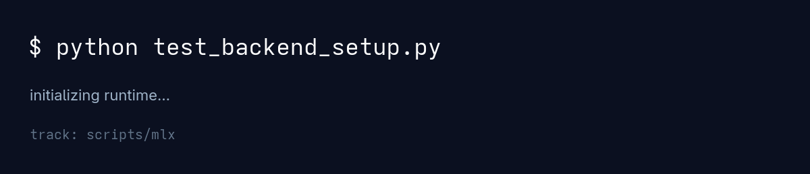
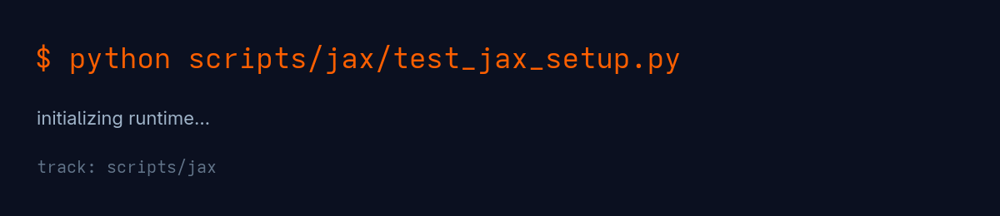
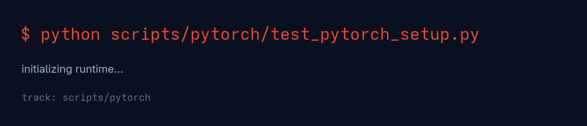
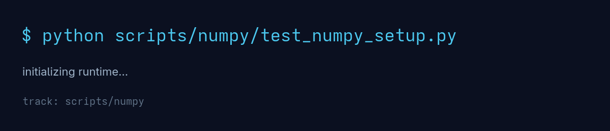
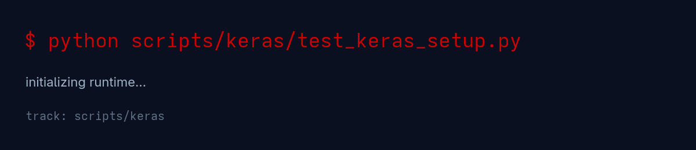
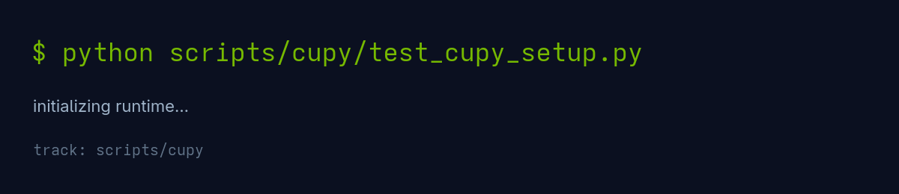

<div align="center">

# tensors-to-consciousness


<p>
  <a href="https://pypi.org/project/mlx/"></a>
  <a href="https://pypi.org/project/jax/"></a>
  <a href="https://pypi.org/project/torch/"></a>
  <a href="https://pypi.org/project/numpy/"></a>
  <a href="https://pypi.org/project/keras/"></a>
  <a href="https://pypi.org/project/cupy-cuda12x/"></a>
</p>

<p>
  <a href="LICENSE"></a>
  <a href="https://deepwiki.com/alexhraber/tensors-to-consciousness"></a>
</p>

<p><strong>Mathematical Foundations of AI/ML Across Frameworks</strong></p>
<p>Canonical backend-selected chapter path + dedicated peer tracks for MLX, JAX, PyTorch, NumPy, Keras, and CuPy.</p>

</div>

---

## Contents

- [What This Repo Is](#what-this-repo-is)
- [Chapter Sequence](#chapter-sequence)
- [Live Previews](#live-previews)
- [Quickstart](#quickstart)
- [Primary Setup Script](#primary-setup-script)
- [Canonical Path (Backend-Selected)](#canonical-path-backend-selected)
- [Dedicated Framework Tracks](#dedicated-framework-tracks)
- [Notes](#notes)
- [Contributing](#contributing)

## What This Repo Is

This repository walks through 7 chapters of AI/ML theory with:

- A backend-abstracted canonical path (`t2c.frameworks`)
- Dedicated framework replicas in `scripts/`:
  - `mlx`
  - `jax`
  - `pytorch`
  - `numpy`
  - `keras`
  - `cupy`

## Chapter Sequence

| # | Chapter | Focus |
|---|---|---|
| 0 | Computational Primitives | Tensors, operations, reductions |
| 1 | Automatic Differentiation | Chain rule, gradients, backpropagation theory |
| 2 | Optimization Theory | Gradient descent, momentum, adaptive methods |
| 3 | Neural Network Theory | Universal approximation, information flow |
| 4 | Advanced Theory | Manifolds, attention, Riemannian optimization |
| 5 | Research Frontiers | Meta-learning, scaling laws, lottery tickets, grokking |
| 6 | Theoretical Limits | Information geometry, consciousness, quantum-inspired computation |

## Live Previews

<table>
  <tr>
    <td><strong>MLX</strong><br></td>
    <td><strong>JAX</strong><br></td>
  </tr>
  <tr>
    <td><strong>PyTorch</strong><br></td>
    <td><strong>NumPy</strong><br></td>
  </tr>
  <tr>
    <td><strong>Keras</strong><br></td>
    <td><strong>CuPy</strong><br></td>
  </tr>
</table>

## Quickstart

### 1) Create environment

```bash
python -m venv env
source env/bin/activate
```

### 2) Pick a framework track

#### MLX

```bash
python setup_framework.py mlx
python scripts/mlx/0_computational_primitives.py
```

#### JAX

```bash
python setup_framework.py jax
python scripts/jax/0_computational_primitives.py
```

#### PyTorch

```bash
python setup_framework.py pytorch
python scripts/pytorch/0_computational_primitives.py
```

#### NumPy

```bash
python setup_framework.py numpy
python scripts/numpy/0_computational_primitives.py
```

#### Keras

```bash
python setup_framework.py keras
python scripts/keras/0_computational_primitives.py
```

#### CuPy

```bash
python setup_framework.py cupy
python scripts/cupy/0_computational_primitives.py
```

## Primary Setup Script

Use `setup_framework.py` as the entrypoint for environment setup and dependency install:

```bash
python setup_framework.py <framework>
```

Supported values:

- `mlx`
- `jax`
- `pytorch`
- `numpy`
- `keras`
- `cupy`
- `all`

What it does:

1. Creates/uses a virtual environment via `uv` (default: `.venv`).
2. Installs framework dependencies with `uv pip install`.
3. Runs the corresponding validation script (`test_*_setup.py`).

Useful options:

```bash
python setup_framework.py jax --venv .venv-jax
python setup_framework.py cupy --skip-validate
python setup_framework.py all
```

## Canonical Path (Backend-Selected)

Main chapter scripts (`0_...py` to `6_...py`) import from `t2c.frameworks`:

```python
import t2c.frameworks as fw

mx = fw.mx
nn = fw.nn
```

Select backend via env var (`mlx` is currently available in the backend abstraction):

```bash
export T2C_BACKEND=mlx
```

### Setup

```bash
python setup_framework.py mlx
```

Validation scripts (legacy-compatible naming):

```bash
python test_mlx_setup.py
python test_backend_setup.py
```

### Run all main chapters

```bash
python 0_computational_primitives.py
python 1_automatic_differentiation.py
python 2_optimization_theory.py
python 3_neural_theory.py
python 4_advanced_theory.py
python 5_research_frontiers.py
python 6_theoretical_limits.py
```

## Dedicated Framework Tracks

All dedicated tracks live under `scripts/<framework>/`.

| Framework | Install | Setup Test | Chapters |
|---|---|---|---|
| MLX | `python setup_framework.py mlx` | `python scripts/mlx/test_mlx_setup.py` | `python scripts/mlx/0_computational_primitives.py` ... `python scripts/mlx/6_theoretical_limits.py` |
| JAX | `python setup_framework.py jax` | `python scripts/jax/test_jax_setup.py` | `python scripts/jax/0_computational_primitives.py` ... `python scripts/jax/6_theoretical_limits.py` |
| PyTorch | `python setup_framework.py pytorch` | `python scripts/pytorch/test_pytorch_setup.py` | `python scripts/pytorch/0_computational_primitives.py` ... `python scripts/pytorch/6_theoretical_limits.py` |
| NumPy | `python setup_framework.py numpy` | `python scripts/numpy/test_numpy_setup.py` | `python scripts/numpy/0_computational_primitives.py` ... `python scripts/numpy/6_theoretical_limits.py` |
| Keras | `python setup_framework.py keras` | `python scripts/keras/test_keras_setup.py` | `python scripts/keras/0_computational_primitives.py` ... `python scripts/keras/6_theoretical_limits.py` |
| CuPy | `python setup_framework.py cupy` | `python scripts/cupy/test_cupy_setup.py` | `python scripts/cupy/0_computational_primitives.py` ... `python scripts/cupy/6_theoretical_limits.py` |

> CuPy: choose the wheel that matches your CUDA version.
> The setup script uses `cupy-cuda12x` by default.

## Notes

- `numpy` and `cupy` tracks use finite-difference gradients in autodiff-heavy sections.
- `keras` track mixes gradient tape with numerical approximations in selected sections.
- Missing dependencies will surface as `ModuleNotFoundError` in setup tests.
- `test_*_setup.py` scripts are validation scripts and are run by `setup_framework.py`.

## Contributing

Contributions are welcome for both backend abstraction work and dedicated framework tracks.

### Add a Backend to `t2c.frameworks` (Main Path)

1. Add `t2c/frameworks/<name>_backend.py` implementing `load() -> Backend`.
2. Register `<name>` in `_AVAILABLE_BACKENDS` inside `t2c/frameworks/__init__.py`.
3. Keep exports aligned with the current contract (`mx`, optional `nn`).
4. Validate with:
   - `python test_backend_setup.py`
   - `T2C_BACKEND=<name> python 0_computational_primitives.py`
   - `T2C_BACKEND=<name> python 1_automatic_differentiation.py`

### Add a Dedicated Framework Track (Latest Pattern)

1. Create `scripts/<framework>/` with:
   - `utils.py`
   - `test_<framework>_setup.py`
   - `0_...py` through `6_...py`
2. Keep chapter naming and progression identical to main path.
3. Document install + setup test + run commands in `README.md`.
4. Prefer framework-native autodiff; if not available, use finite-difference and note it in `Notes`.
