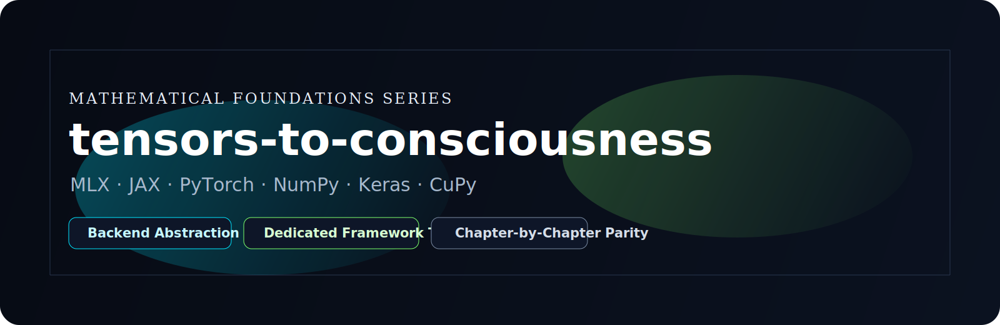
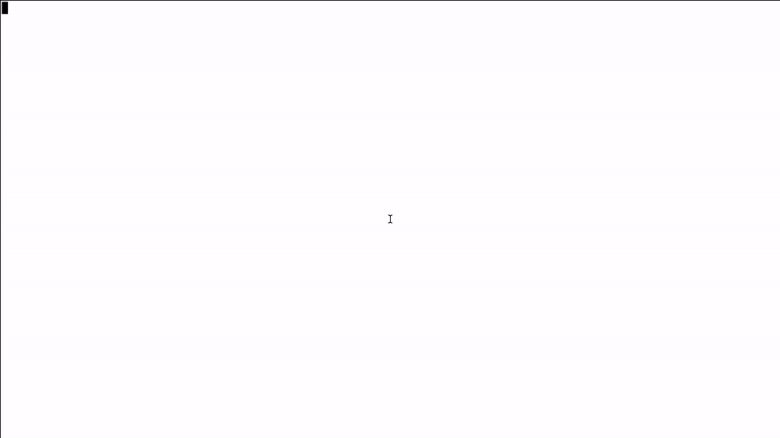
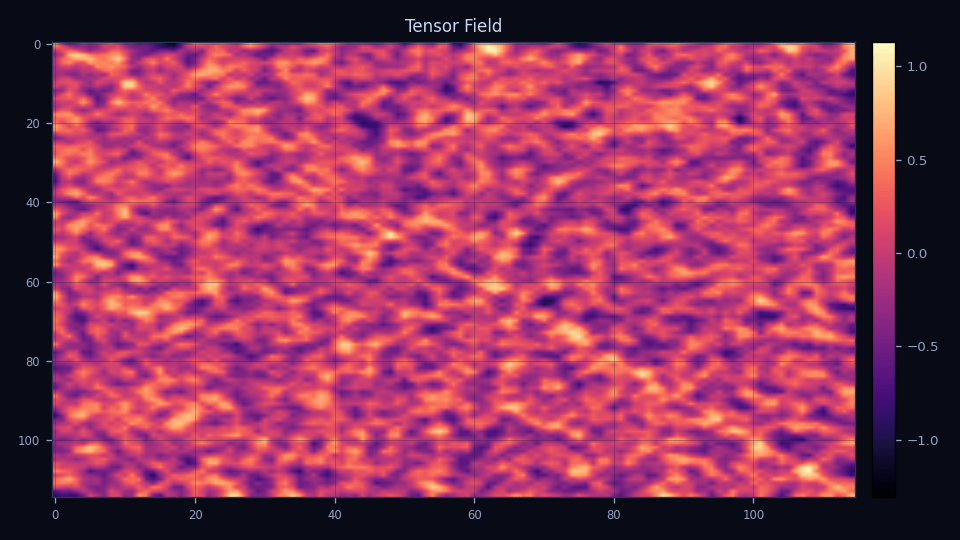
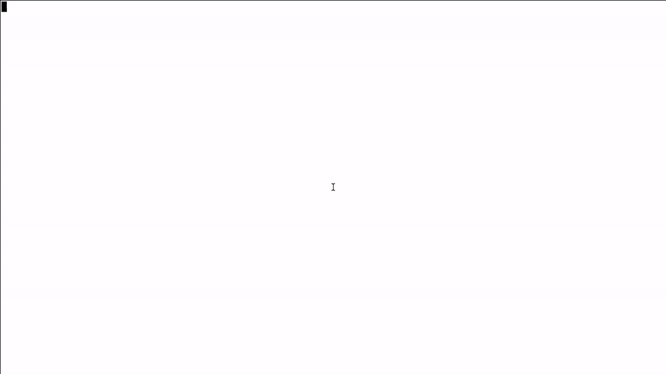

<div align="center">



<p>
  <a href="https://pypi.org/project/mlx/"></a>
  <a href="https://pypi.org/project/jax/"></a>
  <a href="https://pypi.org/project/torch/"></a>
  <a href="https://pypi.org/project/numpy/"></a>
  <a href="https://pypi.org/project/keras/"></a>
  <a href="https://pypi.org/project/cupy-cuda12x/"></a>
</p>

<p>
  <a href="LICENSE"></a>
  <a href="https://github.com/alexhraber/tensors-to-consciousness/actions/workflows/ci.yml"></a>
  
  
</p>

</div>

---

## Tensor Exploration Platform

`tensors-to-consciousness` is an interactive terminal system for exploring tensor transforms across multiple compute frameworks.

## Quickstart

```bash
docker compose build explorer
docker compose run --rm explorer
```

Local:

```bash
mise install
mise run install-test-deps
mise run build
./target/debug/explorer
```

## Explorer Preview

<p align="center">
  
</p>

## Shinkei Render Samples

<p align="center">
  
  
  
</p>

Asset regeneration:

```bash
mise run assets-regenerate
```

## Documentation

- [Documentation Index](docs/README.md)
- [Architecture and Contracts](docs/reference/architecture.md)
- [TUI Guide](docs/usage/tui.md)
- [CLI Guide](docs/usage/cli.md)
- [Container Guide](docs/usage/container.md)
- [Transform Catalog](docs/reference/transforms.md)
- [Supported Frameworks](docs/reference/frameworks.md)
- [Contributing](CONTRIBUTING.md)

## Contributors

<p align="center">
  
</p>

## License

[MIT](LICENSE)
